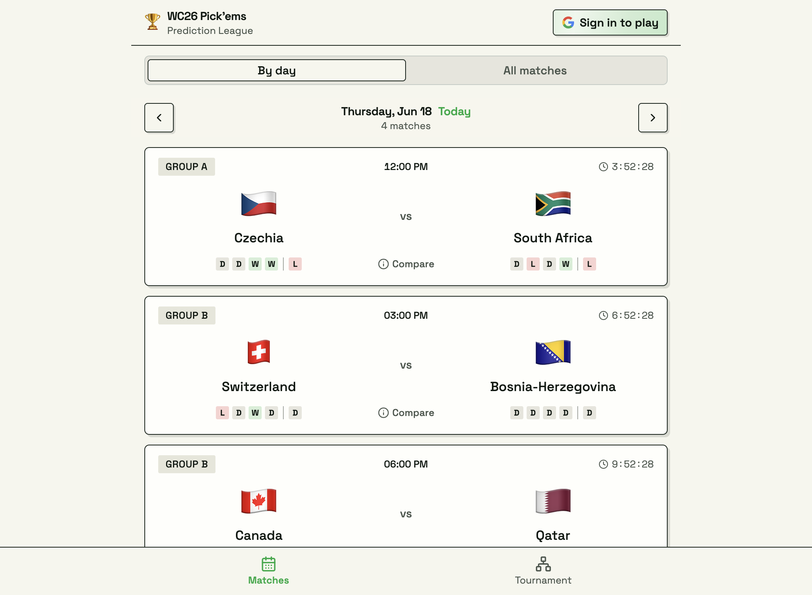

# 🏆 2026 World Soccer Tournament Prediction League

A friends-league prediction game for the 2026 World Soccer Tournament. Predict the exact
score of all **104 matches**, compete on a shared leaderboard, and watch results
sync in automatically from [football-data.org](https://www.football-data.org).

Built with **Vite + React 19 + TypeScript**, **Tailwind CSS v4**, **shadcn/ui**,
**Supabase** (Google auth + Postgres + RLS), and one **Netlify scheduled
function** for result syncing.



## How it works

- **Predict** exact scores. Each match locks at kickoff, enforced in the
  database, not just the UI, so nobody can sneak a late pick.
- **Privacy until lock:** you can't see another player's pick for a match until
  it kicks off. (You *can* see the crowd's most-popular scorelines as anonymous
  aggregate counts, never tied to a name.)
- **Scoring** (computed live in SQL, never stored, so corrections are instant):
  exact score **3 pts**, correct outcome (W/D/L) **1 pt**, multiplied by stage
  (R16/QF/3rd ×2, SF ×3, Final ×4). Knockouts are judged on the
  **90'+extra-time** score; penalty shootouts are shown but never scored.
- **Results sync** every 2 minutes during the tournament. An **admin** page can
  enter or correct any result manually; locked results survive the next sync.

## Quick start

```bash
npm install
cp .env.example .env   # then fill in the five values (see "Setup" below)
npm run dev            # http://localhost:5173
```

The app won't do much until you've created a Supabase project and seeded the
schedule, so if this is a first run, follow the full **Setup** below.

Validate changes with `npm run typecheck`, `npm run lint`, and `npm test`.

## Setup

You need accounts on three services, all free for this project's needs:
[**Supabase**](https://supabase.com) (database + auth), the
[**Google Cloud Console**](https://console.cloud.google.com) (Google sign-in),
and [**football-data.org**](https://www.football-data.org) (live results).
[**Netlify**](https://netlify.com) is a fourth, but only for deploying; you can
run everything locally without it.

By the end you'll have filled in all five variables in `.env`:

| Variable | From | Exposed to browser? |
|---|---|---|
| `VITE_SUPABASE_URL` | Supabase → Project Settings → Data API | ✅ public |
| `VITE_SUPABASE_ANON_KEY` | Supabase → Project Settings → API Keys | ✅ public (safe) |
| `SUPABASE_URL` | same value as `VITE_SUPABASE_URL` | ❌ server only |
| `SUPABASE_SERVICE_ROLE_KEY` | Supabase → Project Settings → API Keys | ❌ **secret** |
| `FOOTBALL_DATA_TOKEN` | football-data.org account page | ❌ server only |

> The `VITE_`-prefixed vars are bundled into the client and are meant to be
> public. The unprefixed ones (especially the **service role key**) bypass all
> security rules: never prefix them with `VITE_`, never commit real values, and
> only ever use them in the Netlify functions and seed scripts.

### 1. Supabase: database, auth, and three keys

1. Create a free project at [supabase.com](https://supabase.com/dashboard)
   (pick a region near you; save the database password somewhere, since Supabase
   asks for it at creation, though this app never needs it).
2. **Run the schema.** Open **SQL Editor** in the dashboard and run each file in
   [`supabase/migrations/`](supabase/migrations/) **in filename order**
   (`0001…`, `0002…`, …). Paste-and-run each one, or if you have the
   [Supabase CLI](https://supabase.com/docs/guides/cli) linked to the project,
   `supabase db push`. This creates the tables, RLS anti-cheat policies, and the
   live-scoring views.
3. **Get your keys.** Go to **Project Settings**:
   - **Data API** → copy the **Project URL** → this is both `VITE_SUPABASE_URL`
     and `SUPABASE_URL` (same value).
   - **API Keys** → copy the **`anon` / `public`** key → `VITE_SUPABASE_ANON_KEY`.
   - **API Keys** → reveal and copy the **`service_role`** key →
     `SUPABASE_SERVICE_ROLE_KEY`. **Treat this like a password.**

### 2. Google sign-in: OAuth client

Sign-in is Google-only, so you need a Google OAuth client and have to tell
Supabase about it.

1. In the [Google Cloud Console](https://console.cloud.google.com), create (or
   pick) a project, then go to **APIs & Services → OAuth consent screen** and
   configure it (External user type is fine; add yourself as a test user).
2. **APIs & Services → Credentials → Create credentials → OAuth client ID →
   Web application.**
3. Under **Authorized redirect URIs**, add the callback URL from your Supabase
   dashboard: **Authentication → Sign In / Providers → Google** shows it, and it
   looks like `https://YOUR-PROJECT.supabase.co/auth/v1/callback`.
4. Copy the generated **Client ID** and **Client secret**, then back in Supabase
   under **Authentication → Sign In / Providers → Google**, enable the provider
   and paste both in. Save.

> These Google values live in the Supabase dashboard, **not** in `.env`; the
> app never sees them directly.

### 3. football-data.org: results API token

1. Register for a free account at
   [football-data.org/client/register](https://www.football-data.org/client/register).
2. Your **API token** is shown on your account page; copy it into
   `FOOTBALL_DATA_TOKEN`.

The free tier covers the World Cup competition and is enough here; the sync
function self-throttles to ~1 request/minute to stay under its rate limit.

### 4. Seed the schedule

With `.env` filled in, load all 104 fixtures into the `matches` table:

```bash
npm run seed                  # from the committed static schedule (offline)
SEED_SOURCE=api npm run seed  # or fetch the official schedule live (recommended)
```

The committed `scripts/data/matches-2026.json` is an illustrative seed. Team
names, kickoff times, knockout participants, and results are all reconciled
against official data by the sync function once `FOOTBALL_DATA_TOKEN` is set.

You can now run `npm run dev` and sign in with Google.

### 5. Make yourself admin

After signing in once, find your user id in Supabase
(**Authentication → Users**) and run this in the SQL Editor:

```sql
update public.profiles set is_admin = true where id = '<your-auth-user-id>';
```

The **Admin** tab then appears for manual result entry.

### 6. Deploy to Netlify (optional)

Local dev needs no Netlify account; this step is only for hosting.

1. Push the repo to GitHub and **import it** in Netlify. Build settings come
   from [`netlify.toml`](netlify.toml) (`npm run build` → `dist/`), so you can
   accept the defaults.
2. In **Site settings → Environment variables**, add all five variables from the
   table above (use the production Supabase URL and keys).
3. Deploy. The scheduled `sync-results` function (cron `*/2 * * * *`, every
   2 min) runs only on the published production deploy; trigger it on demand with
   `netlify functions:invoke sync-results`.

## Project structure

```
src/
  components/       MatchCard, Layout, shared atoms, ui/ (shadcn)
  hooks/            useAuth, TanStack Query data hooks
  lib/              supabase client, scoring, formatting, types (+ unit tests)
  pages/            Login, Welcome, Matches, Leaderboard, Standings, MyPredictions, Admin
netlify/functions/  sync-results.mts (scheduled result fetcher)
netlify/lib/        link-matches.mts (API↔fixture match linker + unit tests)
scripts/            generate-schedule.ts, seed-matches.ts, fd-shared.ts, teams.ts
supabase/migrations/  schema + RLS + scoring views
```

> Architecture details (scoring model, RLS anti-cheat, auth flow) live in
> [`CLAUDE.md`](CLAUDE.md).

## Data & credits

Match fixtures, kickoff times, and live results come from
[football-data.org](https://www.football-data.org), fetched via their free-tier
API (a `FOOTBALL_DATA_TOKEN` is required; register for one
[here](https://www.football-data.org/client/register)). The `sync-results`
Netlify function polls `competitions/WC/matches` every 2 minutes during the
tournament to keep results current.

This is an unofficial, non-commercial project and is not affiliated with or
endorsed by FIFA or football-data.org.
